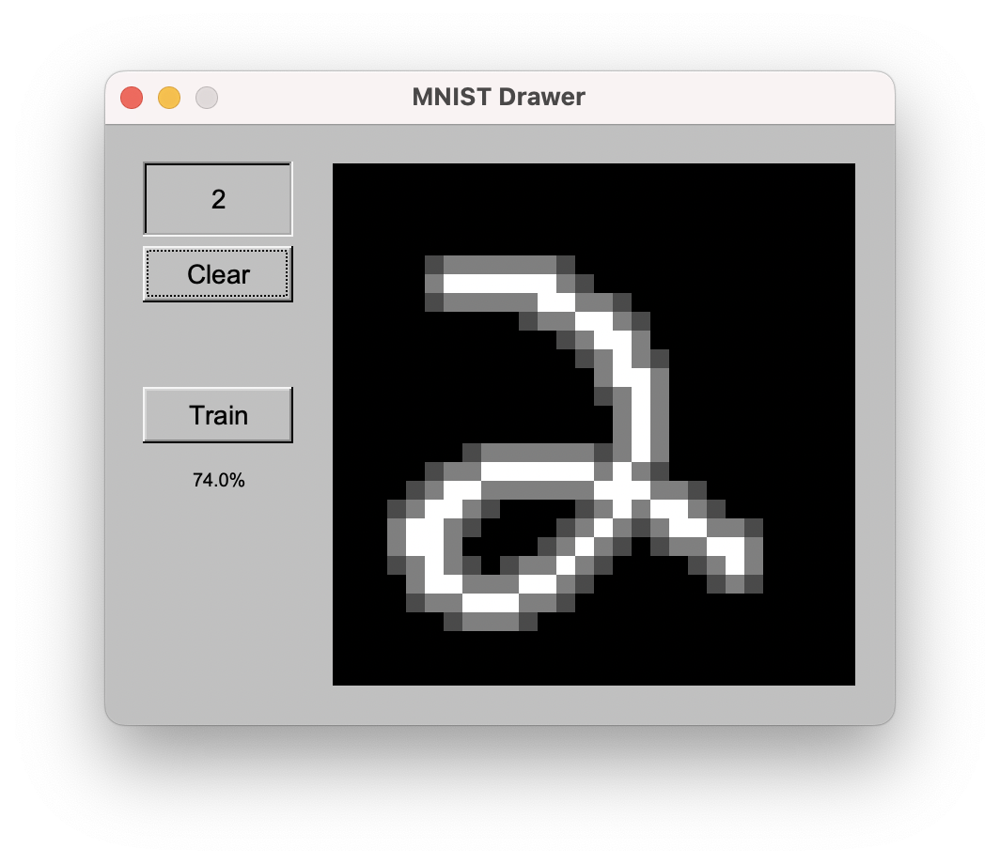

# MNIST Digit Classifier

## What is this?
This is a numerical digit classifier written entirely from scratch using C++ to experiment with neural networks.  
This project uses a neural network trained on the MNIST image dataset to classify numerical digits. The code is roughly based on Samason Zhang's neural network tutorial, however this project is written in C++ instead of python and includes an interactive gui.

## How can I try this out?
You must clone and build this project yourself (Instructions below for UNIX)
I will include a .exe file for windows soon, or you can build this project yourself with cmake

Clone this repository
<pre>
git clone https://github.com/RohanRaj928/NeuralNetwork
cd NeuralNetwork
</pre>
Create a build folder
<pre>
mkdir build
cd build
</pre>
Run cmake
<pre>
cmake ..
make 
</pre>
Run the executable by opening the folder and clicking the executable, or running on console

## How do I use this?
Click the 'train' button to train the neural network. The network has one hidden layer 
with 10 neurons.  
Leave the model to train, when a suitable accuracy you are satisfied with is attained, click stop
(this may take some time).  
Draw a digit in the empty space, the model will predict what it is.
At the moment, there is no pre-trained model available, and you must train the neural network yourself.

